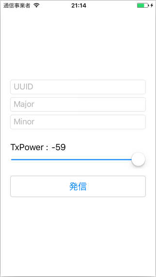
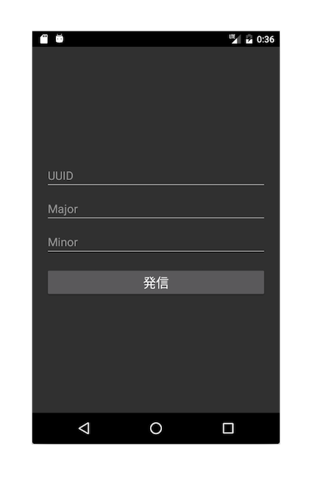
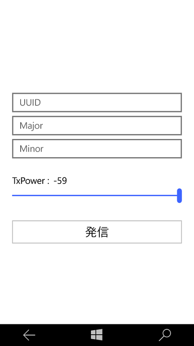

# iBeaconTransmitter

Prism for Xamarin.Forms（Prism.Forms）で作成したiBeacon発信アプリです。

## 対応プラットフォーム
- iOS
- Android
- Windows Phone

## 機能
ユーザーが入力したUUID、Major、Minorを持つ、iBeaconに準拠したフォーマットのアドバタイズメントパケットを発信します。 
TxPowerの調整も可能です。

## 画面ショット
|iOS|Android|Windows Phone|
|---|---|---|
||||

## 注意・免責
- Androidでは、Android5.0以上かつ[multiple advertisementのHCIコマンドに対応している端末](http://altbeacon.github.io/android-beacon-library/beacon-transmitter-devices.html)でのみ発信が可能です。
- 端末によっては発信間隔が100ミリ秒よりも大きくなる場合があります。
- 本アプリの利用は自己責任でお願いします。
